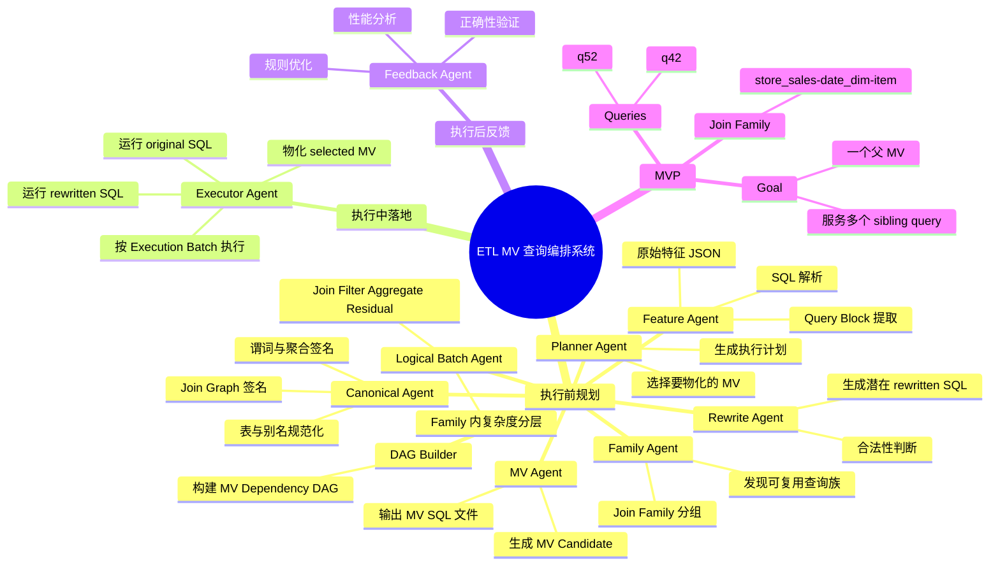
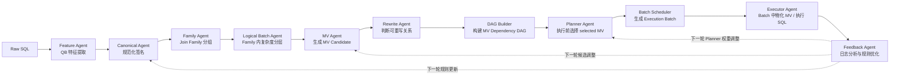

# ETL 场景下基于物化视图的 Agent 查询编排加速系统：工程实现文档

## 0. 文档定位

本文档用于指导工程实现、导师讨论和后续论文方案整理。

当前系统采用如下决策：

> **执行前静态规划，执行中按 Batch 落地。**

具体含义是：

- 执行前：全量扫描 SQL，提取 Query Block，发现 Join Family，生成 MV Candidate，判断潜在重写关系，由 Planner 选择要物化的 MV，并生成 DAG 与 Batch 执行计划；
- 执行中：严格按照执行计划，在对应 Batch 中物化 MV，并运行依赖已完成 MV 的 rewritten SQL；
- 执行后：收集日志，分析收益与失败原因，为下一轮规则优化提供反馈。

一句话概括：

```text
执行前：发现候选 + 选择计划
执行中：按 Batch 物化 MV + 执行重写 SQL
执行后：基于日志反馈优化规则
```

系统整体设计可以称为：

> **Family-first, Batch-guided, DAG-validated MV orchestration**

含义是：

- **Family-first**：MV 复用首先建立在相同或兼容 Join Family 之上；
- **Batch-guided**：在同一 Join Family 内，根据 SQL 操作复杂度、谓词范围和聚合粒度形成递进式逻辑 Batch；
- **DAG-validated**：Batch 间是否真的存在可复用关系，由 MV Dependency DAG 中的合法依赖边表达和验证。

---

## 1. 系统目标与边界

### 1.1 研究目标

本系统面向 ETL 批处理工作负载，尤其是 TPC-DS 这类离线分析 SQL 集合。系统通过分析全量 SQL，自动发现可复用的 Query Block 结构，生成物化视图候选，并将下游 SQL 重写为基于 MV 的 SQL，从而减少重复扫描、重复 Join、重复聚合和 Shuffle 开销。

核心目标包括：

1. 使用 SQLGlot 解析 Spark SQL；
2. 以 Query Block 为单位提取 SQL 特征；
3. 基于 Join Family 聚合可复用查询块；
4. 在 Family 内基于复杂度、谓词和聚合粒度构建逻辑 Batch；
5. 生成 MV Candidate；
6. 判断 MV 与下游 Query / MV 之间的合法复用关系；
7. 构建 MV Dependency DAG；
8. 由 Planner 在执行前选择要物化的 MV；
9. 将选中的 DAG 子图转为执行 Batch；
10. 在 Batch 执行过程中物化 MV、运行 rewritten SQL 和必要的 original SQL；
11. 记录执行日志，并基于日志进行规则反馈优化。

### 1.2 非目标

第一版系统不做以下内容：

1. 不修改 Spark Catalyst 内核；
2. 不实现通用数据库物化视图选择器；
3. 不做在线实时优化；
4. 不在 Batch 执行过程中动态决定所有 MV；
5. 不支持所有复杂 SQL 语义；
6. 不引入 LangChain、AutoGen 等大型 Agent 框架；
7. 不直接声称强化学习，只做 feedback-guided rule tuning。

第一版重点是证明：

> 在 ETL 工作负载中，基于 Query Block 的 MV Candidate 发现、静态规划、DAG 依赖验证与 Batch 执行可以带来稳定收益。

---

## 2. 总体架构

### 2.1 总体流程

```text
Original SQL Files
        ↓
SQLLoader
        ↓
Feature Agent / QBExtractor
        ↓
Canonical Agent
        ↓
Family Agent
        ↓
Logical Batch Builder
        ↓
MV Agent
        ↓
Rewrite Agent
        ↓
DAG Builder
        ↓
Planner Agent
        ↓
Batch Scheduler
        ↓
Executor Agent
        ↓
Feedback Agent
```

### 2.2 阶段划分

系统分为三个阶段。

#### 阶段 A：执行前规划阶段

该阶段不真正执行 Spark SQL，只做全量分析、候选生成和计划选择。

```text
全量 SQL
  ↓
Query Block 特征提取
  ↓
Join Family 分组
  ↓
Family 内复杂度分层，形成逻辑 Batch
  ↓
生成 MV Candidate
  ↓
判断潜在重写关系
  ↓
构建 MV Dependency DAG
  ↓
Planner 选择要物化的 MV
  ↓
生成 Execution Plan + Execution Batch
```

输出包括：

1. Query Block JSON；
2. Canonical Signature JSON；
3. Join Family JSON；
4. Logical Batch JSON；
5. MV Candidate SQL；
6. Rewrite Decision JSON；
7. MV Dependency DAG；
8. Execution Plan；
9. Execution Batch。

#### 阶段 B：Batch 执行阶段

该阶段真正调用 Spark SQL。

```text
Batch-1:
  - 物化计划内的低层 MV
  - 执行无依赖的 original SQL 或独立任务

Batch-2:
  - 执行依赖 Batch-1 MV 的 rewritten SQL
  - 物化计划内的更高层 MV

Batch-3:
  - 执行依赖前序 MV 的 rewritten SQL
  - 执行剩余 original SQL
```

关键点：

- MV 的 SQL 文件在执行前已经生成；
- 是否物化某个 MV 在执行前由 Planner 决定；
- MV 的物理构建发生在 Batch 执行过程中；
- 下游 SQL 的 rewritten SQL 可以在执行前生成，也可以在下游 Batch 开始前生成，但必须依赖已被 Planner 选中的 MV。

#### 阶段 C：执行后反馈阶段

```text
Execution Logs
  ↓
Correctness Validation
  ↓
Performance Evaluation
  ↓
Failure Reason Analysis
  ↓
Rule Feedback
```

反馈结果用于下一轮执行前规划，而不是当前 Batch 中即时修改计划。

---

## 3. Agent 设计

系统中的 Agent 是轻量化模块，不依赖复杂 Agent 框架。

### 3.1 Feature Agent

职责：

- 解析原始 SQL；
- 提取 Query Block；
- 提取表、别名、Join、谓词、Group By、Aggregate、Window 等原始特征；
- 输出 QueryBlock JSON。

输入：

```text
queries/raw/*.sql
```

输出：

```text
artifacts/parsed/*.json
```

---

### 3.2 Canonical Agent

职责：

- 规范化表名与别名；
- 规范化 Join Graph；
- 规范化谓词表达；
- 生成 family key、predicate key、grain key、measure key；
- 输出 Canonical Signature。

输入：

```text
QueryBlock JSON
```

输出：

```text
artifacts/canonical/*.json
```

Feature Agent 和 Canonical Agent 是前后关系：

```text
Feature Agent：看懂 SQL
Canonical Agent：把 SQL 特征变成可比较签名
```

---

### 3.3 Family Agent

职责：

- 根据 Join Family 对 Query Block 分组；
- 发现相同或兼容 Join Skeleton 的查询族；
- 统计 family 内的谓词、group by、measure 共性；
- 输出 QueryFamily JSON。

第一版策略：

```text
exact join graph grouping
```

后续扩展：

- Join 子图匹配；
- alias role 等价；
- 谓词列相似度；
- group by 相似度；
- 层次聚类或图聚类。

---

### 3.4 Logical Batch Agent

职责：

- 在每个 Join Family 内，根据 SQL 操作复杂度和可复用层级形成逻辑 Batch；
- Batch 不直接决定执行顺序，只用于组织递进式 MV Candidate 生成。

推荐逻辑层级：

```text
L0: Base Table
L1: Join Skeleton / Join-level QB
L2: Join + Filter QB
L3: Join + Filter + Aggregate QB
L4: Window / Order / Limit / Final Residual QB
```

输出：

```text
artifacts/batches/logical_batches.json
```

注意：

> 逻辑 Batch 是候选生成和递进关系组织方式，不等于最终执行 Batch。

---

### 3.5 MV Agent

职责：

- 在 Join Family 和逻辑 Batch 基础上生成 MV Candidate；
- 输出 MV SQL 文件；
- 记录 MV 粒度、谓词范围、输出列、measure 信息；
- 初步估算 MV 成本和复用潜力。

MV Candidate 类型：

1. Join-level MV；
2. Filtered MV；
3. Fine-grain Aggregate MV；
4. Derived MV。

第一版建议优先生成：

```text
Filtered Fine-grain Aggregate MV
```

避免过早生成过大的 Join-level MV。

---

### 3.6 Rewrite Agent

职责：

- 判断 MV Candidate 是否可以合法重写下游 Query Block；
- 判断 MV Candidate 是否可以派生另一个下游 MV；
- 生成 Rewrite Decision；
- 为选中的 MV 生成 rewritten SQL。

核心判断：

1. Join Family 兼容；
2. Predicate Containment；
3. Grain Coverage；
4. Measure Derivability；
5. Unsupported Operator Check。

输出：

```text
artifacts/rewritten/*.sql
artifacts/logs/rewrite_decisions.json
```

---

### 3.7 DAG Builder Agent

职责：

- 根据 MV Candidate、Query Block 和 Rewrite Decision 构建 MV Dependency DAG；
- DAG 表达真实依赖关系；
- 每条边都对应一个合法复用理由。

节点类型：

1. Base Table Node；
2. MV Node；
3. Query Node。

边类型：

1. `build_from`；
2. `derive_from`；
3. `rewrite_from`。

输出：

```text
artifacts/dags/mv_dependency_dag.json
```

---

### 3.8 Planner Agent

职责：

- 在执行前选择哪些 MV Candidate 真正物化；
- 为每个可重写查询选择最佳上游 MV；
- 生成 Execution Plan；
- 控制最终执行 DAG 子图。

第一版 Planner 是静态 Planner：

```text
执行前选择 MV；执行中按计划落地。
```

后续可扩展为动态 Planner：

```text
Batch 执行结束后，根据实际耗时和 MV 大小调整后续 Batch 计划。
```

但第一版不建议直接做动态 Planner。

---

### 3.9 Executor Agent

职责：

- 将 Planner 选中的 DAG 子图转为 Execution Batch；
- 按 Batch 调用 Spark SQL；
- 物化 MV；
- 执行 rewritten SQL；
- 执行无法优化的 original SQL；
- 收集执行指标。

---

### 3.10 Feedback Agent

职责：

- 对比 original 与 rewritten 结果；
- 分析 MV 构建成本与查询收益；
- 识别负收益 MV；
- 记录重写失败原因；
- 输出规则调整建议。

第一版反馈是离线规则反馈，不影响当前执行中的 Batch。

---

## 4. DAG + Batch 的关系

### 4.1 核心关系

```text
DAG：表达依赖关系
Batch：DAG 拓扑排序后的执行分组
```

但是在当前决策下，还需要区分两种 Batch：

| 类型 | 作用 | 生成时间 |
|---|---|---|
| Logical Batch | 在 Join Family 内组织递进式候选 MV | 执行前分析阶段 |
| Execution Batch | 根据选中 DAG 子图生成实际执行批次 | 执行前规划阶段 |

### 4.2 当前系统采用的流程

```text
Join Family
  ↓
Logical Batch
  ↓
MV Candidate
  ↓
Rewrite Decision
  ↓
MV Dependency DAG
  ↓
Planner selects selected DAG subgraph
  ↓
Execution Batch
```

### 4.3 为什么需要 DAG

逻辑 Batch 只能表示复杂度层级，例如：

```text
Batch-1: Join
Batch-2: Join + Filter
Batch-3: Join + Filter + Aggregate
```

但它不能表达：

- 哪个 MV 被哪个 SQL 复用；
- 哪个 MV 可以派生另一个 MV；
- 某个下游 SQL 是否真的依赖上游 MV；
- 多个可选 MV 中哪个路径最优。

因此需要 DAG 显式表达依赖。

### 4.4 DAG 边的合法性

每条 DAG 边都来自 Rewrite Agent 的合法性判断。

例如：

```json
{
  "from": "mv_ss_dd_item_mgr1_2000_11",
  "to": "q42_rewritten",
  "edge_type": "rewrite_from",
  "reason": {
    "join_family_compatible": true,
    "predicate_containment": true,
    "grain_coverage": true,
    "measure_derivable": true
  }
}
```

---

## 5. 核心数据结构

### 5.1 QueryBlock

```python
@dataclass
class QueryBlock:
    qb_id: str
    query_id: str
    scope_type: str              # outer / cte / subquery / derived
    scope_path: str
    raw_sql: str

    tables: list[str]
    aliases: dict[str, str]
    join_edges: list["JoinEdge"]

    projection_exprs: list[str]
    predicates: list["Predicate"]
    group_by_exprs: list[str]
    aggregate_exprs: list["AggregateExpr"]
    having_predicates: list["Predicate"]

    has_filter: bool
    has_group_by: bool
    has_aggregate: bool
    has_distinct: bool
    has_window: bool
    has_rollup: bool
    has_subquery: bool
    has_cte: bool
    has_set_op: bool

    complexity_level: str        # join / filter / aggregate / residual
    complexity_score: float
    unsupported_reasons: list[str]
```

---

### 5.2 JoinEdge

```python
@dataclass
class JoinEdge:
    left_table: str
    right_table: str
    left_alias: str
    right_alias: str
    left_key: str
    right_key: str
    join_type: str
    condition_sql: str
```

---

### 5.3 Predicate

```python
@dataclass
class Predicate:
    expr_sql: str
    columns: list[str]
    operator: str               # =, <, >, between, in, like
    constants: list[str]
    normalized_sql: str
    is_join_predicate: bool
    is_filter_predicate: bool
```

---

### 5.4 AggregateExpr

```python
@dataclass
class AggregateExpr:
    func: str                    # SUM / COUNT / AVG / MIN / MAX / STDDEV
    arg: str
    alias: str
    normalized_sql: str
    decomposable: bool
    required_base_measures: list[str]
```

---

### 5.5 CanonicalSignature

```python
@dataclass
class CanonicalSignature:
    qb_id: str
    family_key: str
    join_graph_key: str
    table_set_key: str
    predicate_column_key: str
    predicate_constant_key: str
    grain_key: str
    measure_key: str
    capability_flags: set[str]
```

---

### 5.6 QueryFamily

```python
@dataclass
class QueryFamily:
    family_id: str
    family_key: str
    join_graph_key: str
    members: list[str]
    common_tables: list[str]
    common_join_edges: list[JoinEdge]
    common_predicate_columns: list[str]
    common_measure_exprs: list[str]
    union_group_by_exprs: list[str]
```

---

### 5.7 LogicalBatch

```python
@dataclass
class LogicalBatch:
    logical_batch_id: str
    family_id: str
    level: str                   # join / filter / aggregate / residual
    qb_ids: list[str]
    description: str
```

---

### 5.8 MVCandidate

```python
@dataclass
class MVCandidate:
    mv_id: str
    family_id: str
    source_logical_batch_id: str
    mv_level: str                # join / filtered / aggregate / derived

    source_type: str             # base_tables / upstream_mv
    source_ids: list[str]

    tables: list[str]
    join_edges: list[JoinEdge]
    predicates: list[Predicate]
    group_by_exprs: list[str]
    measure_exprs: list[AggregateExpr]
    output_columns: list[str]

    build_sql: str
    sql_file_path: str
    target_table_name: str

    estimated_input_size: float
    estimated_output_size: float
    estimated_build_cost: float
    estimated_reuse_count: int
    score: float

    selected: bool = False
```

---

### 5.9 RewriteDecision

```python
@dataclass
class RewriteDecision:
    can_rewrite: bool
    upstream_mv_id: str
    downstream_id: str
    downstream_type: str         # query_block / mv
    rewritten_sql: str | None
    rewritten_sql_path: str | None
    reason: dict
    failure_reasons: list[str]
```

---

### 5.10 MVDAG

```python
@dataclass
class DAGNode:
    node_id: str
    node_type: str               # base_table / mv / query
    payload_id: str
    sql_file_path: str | None
    estimated_cost: float
    selected: bool = False
```

```python
@dataclass
class DAGEdge:
    source_id: str
    target_id: str
    edge_type: str               # build_from / derive_from / rewrite_from
    reason: dict
```

```python
@dataclass
class MVDAG:
    nodes: dict[str, DAGNode]
    edges: list[DAGEdge]
```

---

### 5.11 ExecutionPlan / ExecutionBatch

```python
@dataclass
class ExecutionTask:
    task_id: str
    task_type: str               # build_mv / run_rewritten_query / run_original_query
    sql_path: str
    output_table: str | None
    dependencies: list[str]
    priority: float
```

```python
@dataclass
class ExecutionBatch:
    batch_id: str
    tasks: list[ExecutionTask]
    max_concurrency: int
```

```python
@dataclass
class ExecutionPlan:
    selected_mv_ids: list[str]
    rewritten_query_ids: list[str]
    original_query_ids: list[str]
    batches: list[ExecutionBatch]
```

---

## 6. 模块实现设计

## 6.1 SQLLoader

职责：读取原始 SQL 文件。

```python
class SQLLoader:
    def load_dir(self, path: str) -> list[RawQuery]:
        ...

    def load_file(self, path: str) -> RawQuery:
        ...
```

---

## 6.2 FeatureAgent

职责：解析 SQL，提取 QueryBlock。

```python
class FeatureAgent:
    def parse_sql(self, query: RawQuery) -> list[QueryBlock]:
        ...

    def extract_tables(self, select_node) -> list[str]:
        ...

    def extract_join_edges(self, select_node) -> list[JoinEdge]:
        ...

    def extract_predicates(self, select_node) -> list[Predicate]:
        ...

    def extract_group_by(self, select_node) -> list[str]:
        ...

    def extract_aggregates(self, select_node) -> list[AggregateExpr]:
        ...

    def classify_complexity(self, qb: QueryBlock) -> str:
        ...
```

复杂度分类建议：

```text
join：包含 Join，无 filter / aggregate
filter：包含 Join + filter，无 aggregate
aggregate：包含 Join / filter + group by / aggregate
residual：包含 window / order / limit / rollup 等外层残差
unsupported：包含当前不支持的复杂结构
```

---

## 6.3 CanonicalAgent

职责：生成可比较签名。

```python
class CanonicalAgent:
    def canonicalize(self, qb: QueryBlock) -> CanonicalSignature:
        ...

    def canonical_join_graph(self, qb: QueryBlock) -> str:
        ...

    def canonical_predicates(self, qb: QueryBlock) -> tuple[str, str]:
        ...

    def canonical_grain(self, qb: QueryBlock) -> str:
        ...

    def canonical_measures(self, qb: QueryBlock) -> str:
        ...
```

第一版可以先使用表集合 + Join key 排序作为 family key。

对于重复维表 alias，例如 `date_dim` 出现多次，需要保留 alias role，不能简单去重。

---

## 6.4 FamilyAgent

职责：按 Join Family 分组。

```python
class FamilyAgent:
    def detect(self, qbs: list[QueryBlock], sigs: list[CanonicalSignature]) -> list[QueryFamily]:
        ...

    def group_by_join_family(self, sigs: list[CanonicalSignature]) -> dict[str, list[str]]:
        ...
```

第一版策略：

```text
family_key 完全相同 → 同一个 family
```

---

## 6.5 LogicalBatchAgent

职责：在 Family 内形成逻辑 Batch。

```python
class LogicalBatchAgent:
    def build_logical_batches(
        self,
        family: QueryFamily,
        qbs: list[QueryBlock]
    ) -> list[LogicalBatch]:
        ...
```

逻辑分层：

```text
L1: join-level
L2: filter-level
L3: aggregate-level
L4: residual-level
```

逻辑 Batch 的用途：

1. 组织递进式 MV Candidate；
2. 标记哪些低层结构可能被高层复用；
3. 辅助 Planner 估算构建顺序。

注意：

> Logical Batch 不等于最终 Execution Batch。

---

## 6.6 MVAgent

职责：生成 MV Candidate。

```python
class MVAgent:
    def generate_candidates(
        self,
        family: QueryFamily,
        logical_batches: list[LogicalBatch],
        qbs: list[QueryBlock]
    ) -> list[MVCandidate]:
        ...

    def generate_join_level_mv(self, family: QueryFamily) -> MVCandidate:
        ...

    def generate_filtered_mv(self, family: QueryFamily) -> MVCandidate:
        ...

    def generate_fine_grain_aggregate_mv(self, family: QueryFamily) -> MVCandidate:
        ...

    def build_mv_sql(self, mv: MVCandidate) -> str:
        ...
```

第一版重点：

```text
Filtered Fine-grain Aggregate MV
```

父 MV 生成规则：

1. Join 表集合取 family 的 Join Graph；
2. Join 条件取公共 Join 条件；
3. Filter 优先取 family 内完全相同或高频公共谓词；
4. Group By 取下游查询 group by 并集，并补充后续 filter 需要的列；
5. Measure 取下游查询需要的可分解聚合；
6. 输出 CTAS SQL 文件。

---

## 6.7 RewriteAgent

职责：合法性检查和 SQL 重写。

```python
class RewriteAgent:
    def can_rewrite_query(self, qb: QueryBlock, mv: MVCandidate) -> RewriteDecision:
        ...

    def can_derive_mv(self, child_mv: MVCandidate, parent_mv: MVCandidate) -> RewriteDecision:
        ...

    def rewrite_query(self, qb: QueryBlock, mv: MVCandidate) -> str:
        ...
```

### 6.7.1 Join Family Compatibility

第一版要求：

```text
qb.family_key == mv.family_key
```

### 6.7.2 Predicate Containment

要求：

```text
DownstreamPredicate ⇒ UpstreamPredicate
```

例如：

```text
上游 MV: d_year = 2000
下游 Query: d_year = 2000 AND d_moy = 11
```

可以复用。

```text
上游 MV: d_year = 2000
下游 Query: d_year = 2001
```

不能复用。

第一版支持：

1. equality；
2. BETWEEN；
3. IN；
4. AND。

暂不支持复杂 OR 推理。

### 6.7.3 Grain Coverage

要求：

```text
QueryGroupBy ⊆ MVGroupBy
```

也就是 MV 粒度必须细于或等于查询需求。

### 6.7.4 Measure Derivability

支持规则：

| Query Measure | MV Requirement |
|---|---|
| SUM(x) | SUM(x) |
| COUNT(*) | COUNT(*) |
| AVG(x) | SUM(x), COUNT(x) |
| MIN(x) | MIN(x) |
| MAX(x) | MAX(x) |
| STDDEV(x) | 第一版不支持 |
| COUNT DISTINCT | 第一版不支持 |

### 6.7.5 Unsupported Operator

第一版跳过：

1. DISTINCT；
2. complex window；
3. rollup / cube；
4. correlated subquery；
5. set operation；
6. non-decomposable aggregate。

---

## 6.8 DAGBuilderAgent

职责：构建 MV Dependency DAG。

```python
class DAGBuilderAgent:
    def build(
        self,
        base_tables: list[str],
        mv_candidates: list[MVCandidate],
        qbs: list[QueryBlock],
        decisions: list[RewriteDecision]
    ) -> MVDAG:
        ...

    def validate_acyclic(self, dag: MVDAG) -> bool:
        ...
```

构建逻辑：

1. 添加 Base Table 节点；
2. 添加 MV Candidate 节点；
3. 添加 Query 节点；
4. 为 MV 添加 base table dependency；
5. 根据 Rewrite Decision 添加 `rewrite_from` 边；
6. 根据 MV 派生关系添加 `derive_from` 边；
7. 检查是否存在环。

---

## 6.9 PlannerAgent

职责：执行前静态选择。

```python
class PlannerAgent:
    def select_plan(
        self,
        dag: MVDAG,
        mv_candidates: list[MVCandidate],
        decisions: list[RewriteDecision],
        max_concurrency: int
    ) -> ExecutionPlan:
        ...

    def score_mv(self, mv: MVCandidate) -> float:
        ...

    def choose_best_mv_for_query(self, qb_id: str, candidate_mvs: list[MVCandidate]) -> str | None:
        ...
```

### 6.9.1 评分函数

第一版简化评分：

```text
score(mv) = reuse_count
            - α * estimated_input_size
            - β * estimated_output_size
            - γ * unsupported_risk
```

更完整版本：

```text
score(mv) = Σ(original_cost(q) - rewritten_cost(q))
            - build_cost(mv)
            - storage_penalty(mv)
            - residual_cost(mv)
```

### 6.9.2 选择规则

1. 只选择 score 大于阈值的 MV；
2. 优先选择 reuse_count 高的 MV；
3. 默认惩罚过大的 join-level MV；
4. 对同一查询，如果多个 MV 可用，选择 residual cost 最低的；
5. 如果查询无可用 MV，则保留 original SQL。

### 6.9.3 静态规划原则

第一版 Planner 在执行前完成选择：

```text
MV candidate 是执行前发现的；
selected MV 是执行前决定的；
MV table 是 Batch 执行时物化的；
rewritten SQL 基于 selected MV 生成。
```

---

## 6.10 BatchScheduler

职责：将 Planner 选中的 DAG 子图转成 Execution Batch。

```python
class BatchScheduler:
    def schedule(self, plan: ExecutionPlan, dag: MVDAG) -> list[ExecutionBatch]:
        ...

    def get_ready_tasks(self, unfinished_tasks, finished_tasks) -> list[ExecutionTask]:
        ...

    def pick_batch(self, ready_tasks, max_concurrency: int) -> ExecutionBatch:
        ...
```

执行规则：

1. 所有依赖完成的任务可以进入 ready set；
2. 每个 batch 最多执行 `max_concurrency` 个任务；
3. MV build task 必须早于依赖它的 rewritten query；
4. original query 是 independent task，可灵活插入；
5. 如果资源有限，优先执行高收益 MV build task。

第一版可以采用简化策略：

```text
Execution Batch-1:
  build selected low-level MVs

Execution Batch-2:
  run rewritten queries depending on Batch-1 MVs
  run independent original queries
```

更通用策略：

```text
while unfinished_tasks:
    ready_tasks = tasks whose dependencies are finished
    batch = pick_top_k(ready_tasks, max_concurrency)
    run(batch)
```

---

## 6.11 ExecutorAgent

职责：执行 SQL。

```python
class ExecutorAgent:
    def execute_plan(self, plan: ExecutionPlan) -> list[TaskResult]:
        ...

    def execute_batch(self, batch: ExecutionBatch) -> list[TaskResult]:
        ...

    def execute_sql_file(self, sql_path: str) -> TaskResult:
        ...
```

MV 物化方式建议：

```sql
CREATE OR REPLACE TABLE mv_x AS
SELECT ...
```

调试时可以使用：

```sql
CACHE TABLE mv_x AS
SELECT ...
```

但论文实验建议优先 CTAS，因为它更接近真实物化。

---

## 6.12 FeedbackAgent

职责：执行后反馈。

```python
class FeedbackAgent:
    def analyze_execution_logs(self, logs: list[TaskResult]) -> FeedbackReport:
        ...

    def generate_rule_updates(self, report: FeedbackReport) -> list[RuleUpdate]:
        ...
```

反馈规则示例：

```text
if mv_build_cost > saved_query_cost:
    lower_priority(family)

if mv_output_size too_large:
    increase_output_size_penalty

if rewrite_failed_due_to_missing_filter_col:
    add_filter_col_preservation_rule

if rewrite_failed_due_to_missing_measure:
    add_measure_preservation_rule

if family repeatedly positive:
    increase_family_priority
```

---

## 7. 工程目录结构

```text
project/
├── README.md
├── pyproject.toml
├── configs/
│   ├── default.yaml
│   ├── spark.yaml
│   └── rules.yaml
├── data/
│   ├── schema/
│   │   └── tpcds_schema.json
│   └── statistics/
│       └── table_stats.json
├── queries/
│   ├── raw/
│   │   ├── q42.sql
│   │   └── q52.sql
│   └── normalized/
├── artifacts/
│   ├── parsed/
│   ├── canonical/
│   ├── families/
│   ├── logical_batches/
│   ├── mvs/
│   ├── rewritten/
│   ├── dags/
│   ├── plans/
│   ├── execution_batches/
│   └── logs/
├── src/
│   ├── main.py
│   ├── common/
│   │   ├── models.py
│   │   ├── io.py
│   │   ├── config.py
│   │   └── logger.py
│   ├── loader/
│   │   └── sql_loader.py
│   ├── parser/
│   │   ├── feature_agent.py
│   │   ├── qb_extractor.py
│   │   └── ast_utils.py
│   ├── canonical/
│   │   ├── canonical_agent.py
│   │   ├── predicate_normalizer.py
│   │   └── join_graph.py
│   ├── family/
│   │   └── family_agent.py
│   ├── batch/
│   │   └── logical_batch_agent.py
│   ├── mv/
│   │   ├── mv_agent.py
│   │   ├── mv_sql_builder.py
│   │   └── mv_cost_estimator.py
│   ├── rewrite/
│   │   ├── rewrite_agent.py
│   │   ├── rewrite_rules.py
│   │   └── query_rewriter.py
│   ├── dag/
│   │   ├── dag_builder_agent.py
│   │   └── graph_models.py
│   ├── planner/
│   │   ├── planner_agent.py
│   │   ├── scorer.py
│   │   └── batch_scheduler.py
│   ├── executor/
│   │   ├── executor_agent.py
│   │   ├── spark_executor.py
│   │   └── execution_logger.py
│   └── evaluator/
│       ├── result_validator.py
│       ├── metrics_collector.py
│       └── feedback_agent.py
└── tests/
    ├── test_feature_agent.py
    ├── test_canonical_agent.py
    ├── test_family_agent.py
    ├── test_logical_batch_agent.py
    ├── test_mv_agent.py
    ├── test_rewrite_agent.py
    ├── test_dag_builder_agent.py
    ├── test_planner_agent.py
    └── test_batch_scheduler.py
```

---

## 8. 端到端命令流程

### 8.1 Analyze

```bash
python -m src.main analyze \
  --query-dir queries/raw \
  --config configs/default.yaml
```

执行：

1. 读取 SQL；
2. 提取 Query Block；
3. 生成 Canonical Signature；
4. 识别 Join Family；
5. 形成 Logical Batch。

输出：

```text
artifacts/parsed/
artifacts/canonical/
artifacts/families/
artifacts/logical_batches/
```

---

### 8.2 Generate MV Candidate

```bash
python -m src.main generate-mv \
  --family-dir artifacts/families \
  --logical-batch-dir artifacts/logical_batches
```

执行：

1. 读取 Join Family；
2. 读取 Logical Batch；
3. 生成 MV Candidate；
4. 输出 MV SQL 文件；
5. 初步估算成本。

输出：

```text
artifacts/mvs/*.sql
artifacts/mvs/mv_candidates.json
```

---

### 8.3 Rewrite Analysis

```bash
python -m src.main rewrite \
  --mv-candidates artifacts/mvs/mv_candidates.json \
  --parsed-dir artifacts/parsed
```

执行：

1. 判断 MV → Query 是否可重写；
2. 判断 MV → MV 是否可派生；
3. 输出 Rewrite Decision；
4. 暂存 rewritten SQL。

输出：

```text
artifacts/rewritten/*.sql
artifacts/logs/rewrite_decisions.json
```

---

### 8.4 Build DAG

```bash
python -m src.main build-dag
```

执行：

1. 添加 Base Table 节点；
2. 添加 MV Candidate 节点；
3. 添加 Query 节点；
4. 添加合法依赖边；
5. 输出 DAG。

输出：

```text
artifacts/dags/mv_dependency_dag.json
```

---

### 8.5 Plan

```bash
python -m src.main plan \
  --max-concurrency 20
```

执行：

1. Planner 对 MV Candidate 打分；
2. 选择 selected MV；
3. 选择每个 query 的最佳重写路径；
4. 生成 Execution Plan；
5. 生成 Execution Batch。

输出：

```text
artifacts/plans/execution_plan.json
artifacts/execution_batches/batches.json
```

---

### 8.6 Execute

```bash
python -m src.main execute \
  --plan artifacts/plans/execution_plan.json
```

执行：

1. 按 Batch 执行；
2. 物化 selected MV；
3. 执行 rewritten SQL；
4. 执行 original SQL；
5. 记录日志。

输出：

```text
artifacts/logs/execution_log.json
artifacts/logs/metrics.json
```

---

### 8.7 Evaluate

```bash
python -m src.main evaluate
```

执行：

1. 结果正确性验证；
2. 性能对比；
3. 统计 MV hit rate、rewrite success rate、net speedup；
4. 输出反馈规则。

输出：

```text
artifacts/logs/validation_log.json
artifacts/logs/performance_report.json
artifacts/logs/feedback_rules.json
```

---

## 9. MVP 示例：q42 / q52

### 9.1 输入查询族

```text
Join Family: store_sales ⋈ date_dim ⋈ item
Queries: q42, q52
```

特点：

- Join skeleton 相同；
- Filter 相同；
- Measure 相同；
- Group By 不同；
- 适合一个父 MV 服务多个 sibling query。

### 9.2 MV Candidate

```sql
CREATE OR REPLACE TABLE mv_ss_dd_item_mgr1_2000_11 AS
SELECT
  dt.d_year,
  dt.d_moy,
  item.i_manager_id,
  item.i_category_id,
  item.i_category,
  item.i_brand_id,
  item.i_brand,
  SUM(store_sales.ss_ext_sales_price) AS sum_ext_sales_price
FROM date_dim dt, store_sales, item
WHERE dt.d_date_sk = store_sales.ss_sold_date_sk
  AND store_sales.ss_item_sk = item.i_item_sk
  AND item.i_manager_id = 1
  AND dt.d_moy = 11
  AND dt.d_year = 2000
GROUP BY
  dt.d_year,
  dt.d_moy,
  item.i_manager_id,
  item.i_category_id,
  item.i_category,
  item.i_brand_id,
  item.i_brand;
```

### 9.3 q42 rewritten

```sql
SELECT
  d_year,
  i_category_id,
  i_category,
  SUM(sum_ext_sales_price) AS sum_ext_sales_price
FROM mv_ss_dd_item_mgr1_2000_11
GROUP BY
  d_year,
  i_category_id,
  i_category
ORDER BY
  sum_ext_sales_price DESC,
  d_year,
  i_category_id,
  i_category
LIMIT 100;
```

### 9.4 q52 rewritten

```sql
SELECT
  d_year,
  i_brand_id AS brand_id,
  i_brand AS brand,
  SUM(sum_ext_sales_price) AS ext_price
FROM mv_ss_dd_item_mgr1_2000_11
GROUP BY
  d_year,
  i_brand_id,
  i_brand
ORDER BY
  d_year,
  ext_price DESC,
  brand_id
LIMIT 100;
```

### 9.5 DAG

```text
store_sales
 date_dim
 item
   ↓
mv_ss_dd_item_mgr1_2000_11
   ↓        ↓
q42_rw   q52_rw
```

### 9.6 Execution Batch

```text
Execution Batch-1:
  build mv_ss_dd_item_mgr1_2000_11

Execution Batch-2:
  run q42_rewritten
  run q52_rewritten
```

若还有无法重写的 SQL：

```text
Original SQL = independent task
```

由 BatchScheduler 根据并发上限插入合适 Batch。

---

## 10. 特征提取 JSON 示例

```json
{
  "qb_id": "q42_qb1",
  "query_id": "q42",
  "scope_type": "outer",
  "tables": ["store_sales", "date_dim", "item"],
  "aliases": {
    "dt": "date_dim",
    "item": "item",
    "store_sales": "store_sales"
  },
  "join_edges": [
    {
      "left_table": "date_dim",
      "right_table": "store_sales",
      "left_key": "d_date_sk",
      "right_key": "ss_sold_date_sk",
      "join_type": "inner"
    },
    {
      "left_table": "store_sales",
      "right_table": "item",
      "left_key": "ss_item_sk",
      "right_key": "i_item_sk",
      "join_type": "inner"
    }
  ],
  "family_key": "date_dim-store_sales-item",
  "predicates": [
    "item.i_manager_id = 1",
    "dt.d_moy = 11",
    "dt.d_year = 2000"
  ],
  "group_by": [
    "dt.d_year",
    "item.i_category_id",
    "item.i_category"
  ],
  "aggregates": [
    "SUM(ss_ext_sales_price)"
  ],
  "has_filter": true,
  "has_group_by": true,
  "has_window": false,
  "has_distinct": false,
  "complexity_level": "aggregate"
}
```

---

## 11. 配置文件设计

### 11.1 default.yaml

```yaml
project:
  name: etl-mv-orchestrator
  dialect: spark

paths:
  query_dir: queries/raw
  artifact_dir: artifacts
  schema_path: data/schema/tpcds_schema.json
  stats_path: data/statistics/table_stats.json

planning:
  mode: static
  max_concurrency: 20
  min_mv_score: 0.0

logical_batch:
  enable_complexity_batching: true
  levels:
    - join
    - filter
    - aggregate
    - residual

mv:
  materialization_mode: ctas
  enable_join_level_mv: false
  enable_filtered_mv: true
  enable_aggregate_mv: true

rewrite:
  support_sum: true
  support_count: true
  support_avg: true
  support_stddev: false
  support_count_distinct: false
  support_window: false

feedback:
  enable_rule_feedback: true
  apply_feedback_next_run_only: true
```

### 11.2 rules.yaml

```yaml
predicate_containment:
  support_equal: true
  support_between: true
  support_in: true
  support_and: true
  support_or: false

grain_coverage:
  require_query_group_by_subset_of_mv_group_by: true

measure_derivability:
  sum: [sum]
  count: [count]
  avg: [sum, count]
  min: [min]
  max: [max]

planner:
  alpha_input_size: 0.1
  beta_output_size: 0.5
  gamma_unsupported_risk: 1.0
```

---

## 12. 实验设计

### 12.1 实验组

| 实验组 | 含义 |
|---|---|
| Baseline | 原始 SQL 直接运行 |
| Manual MV | 人工 MV + 人工重写 |
| Auto Candidate Only | 自动生成 MV Candidate，但不做 Planner 选择 |
| Ours | 自动 Candidate + Rewrite + DAG + Static Planner + Batch Execution |

### 12.2 数据规模

建议：

```text
SF1 → SF10 → SF100
```

调试阶段使用 SF1 / SF10；正式实验至少使用 SF100。

### 12.3 核心指标

1. workload total runtime；
2. workload makespan；
3. per-query runtime；
4. MV build time；
5. rewritten query runtime；
6. net speedup；
7. scan bytes；
8. shuffle read bytes；
9. shuffle write bytes；
10. MV output size；
11. MV hit rate；
12. rewrite success rate；
13. negative speedup ratio；
14. correctness pass rate。

### 12.4 正确性验证

每个 rewritten query 必须与 original query 对比。

验证方式：

1. 行数一致；
2. 排序后结果一致；
3. 浮点数允许 epsilon；
4. 对 `ORDER BY + LIMIT` 保留排序语义；
5. 对非确定性排序使用 multiset comparison 或补充 tie-breaker。

---

## 13. Mermaid 思维导图



---

## 14. Mermaid 流程图



---

## 15. 开发路线图

### 阶段 1：SQL 解析与 QB 特征提取

交付物：

1. SQLLoader；
2. FeatureAgent；
3. QueryBlock JSON；
4. q42 / q52 解析结果；
5. 单元测试。

---

### 阶段 2：Canonical + Family + Logical Batch

交付物：

1. CanonicalSignature；
2. Join Family 分组结果；
3. Logical Batch JSON；
4. `store_sales-date_dim-item` family 识别结果。

---

### 阶段 3：MV Candidate 生成

交付物：

1. MVCandidate JSON；
2. q42/q52 父 MV SQL；
3. MV 输出列检查；
4. MV build SQL 测试。

---

### 阶段 4：Rewrite + DAG

交付物：

1. RewriteDecision JSON；
2. q42 rewritten SQL；
3. q52 rewritten SQL；
4. MV Dependency DAG JSON。

---

### 阶段 5：Static Planner + Execution Batch

交付物：

1. Planner scoring；
2. selected MV 列表；
3. Execution Plan；
4. Execution Batch。

---

### 阶段 6：Spark Execution + Evaluation

交付物：

1. Baseline execution log；
2. MV execution log；
3. correctness validation log；
4. performance report。

---

### 阶段 7：扩展更多 family

优先级：

1. `store_sales ⋈ date_dim ⋈ item`；
2. `store_sales ⋈ date_dim ⋈ store`；
3. 多 fact complex family。

---

## 16. 风险与规避

### 16.1 SQLGlot 解析覆盖不足

规避：

- 对失败 SQL 标记 unsupported；
- 第一版聚焦 q42/q52；
- 逐步扩展语法覆盖。

### 16.2 MV 太大导致负收益

规避：

- 默认关闭 join-level MV；
- 优先 filtered aggregate MV；
- Planner 加入 output size penalty。

### 16.3 重写语义错误

规避：

- Rewrite Validator 严格检查；
- 每条 rewritten SQL 做结果验证；
- 第一版只支持可证明正确的 SUM / COUNT / AVG。

### 16.4 Batch 逻辑和 DAG 逻辑混淆

规避：

- 明确区分 Logical Batch 和 Execution Batch；
- Logical Batch 用于候选组织；
- Execution Batch 由 DAG + Planner 生成。

### 16.5 Agent 概念过虚

规避：

- Agent 只是工程模块；
- 论文贡献写成 Query Block 级 MV 编排；
- Feedback 写成规则调优，不写成完整 RL。

---

## 17. 最终方案表述

建议在 PPT / 开题文档中这样描述：

> 系统首先在执行前对全量 SQL 进行静态分析，提取 Query Block 特征，并基于 Join Family 发现可复用查询族。在每个 Family 内，系统按照 Join、Filter、Aggregate、Residual 等复杂度层级形成逻辑 Batch，并生成不同层级的 MV Candidate。随后，Rewrite Agent 判断 MV Candidate 与下游 Query / MV 之间是否存在合法复用关系，包括 Join Family 兼容、谓词包含、粒度覆盖和度量可推导。所有合法复用关系被组织为 MV Dependency DAG。Planner 在执行前根据复用收益、构建成本和输出大小选择要物化的 MV，并将选中的 DAG 子图转化为 Execution Batch。执行时，系统在对应 Batch 中物化 selected MV，并在后续 Batch 中运行依赖这些 MV 的 rewritten SQL；无法被优化的 SQL 作为 independent task 执行。执行完成后，Feedback Agent 基于日志分析收益和失败原因，用于下一轮规则优化。

---

## 18. 最小可运行闭环

第一版只需要实现：

```text
Input:
  q42.sql
  q52.sql

Analyze:
  extract QueryBlock
  canonicalize signatures
  detect store_sales-date_dim-item family
  build logical batches

Generate:
  generate mv_ss_dd_item_mgr1_2000_11 candidate

Rewrite:
  validate q42/q52 rewrite legality
  generate rewritten SQL

DAG:
  build Base Tables → MV → q42/q52 graph

Plan:
  select MV
  generate execution batches

Execute:
  Batch-1 build MV
  Batch-2 run q42/q52 rewritten

Evaluate:
  compare correctness
  compare baseline runtime
```

这一闭环完成后，再扩展更多 TPC-DS 查询族。

